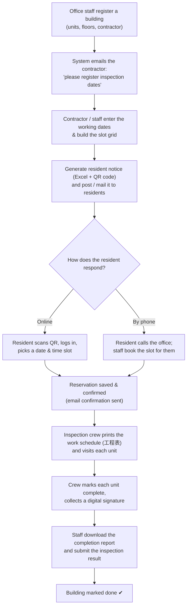

# 01. Project Overview

> Plain-language introduction to the system. Written for non-technical readers (managers, new staff, building owners).

---

## What this system is

This is a **fire-equipment inspection booking and management system** built for **Hochiki / NESPE** (a Japanese fire-protection company). In Japan, every apartment building (called a **マンション / "mansion"**) is required by law to have its fire-alarm and fire-prevention equipment inspected regularly. To do that inspection, technicians must enter each individual apartment unit.

The hard part is **coordinating with residents**: every household needs to pick a time when they will be home so an inspector can come in. This system automates that whole coordination process — from telling residents an inspection is coming, to letting them book a time slot online, to giving the inspection crew a printed work schedule, to recording that the job was completed.

Internally the project is two cooperating websites that share one database:

| Part | Folder | Who it serves |
|------|--------|---------------|
| **Resident portal** | `httpdocs/login.php`, `top.php`, `reserve_*.php` … | Apartment residents booking their inspection slot |
| **Staff / contractor console** | `httpdocs/s_*.php`, `sh_*.php`, `top_kanri.php` … | NESPE office staff and the inspection contractors |

Both parts run on a custom in-house PHP framework called **SPFW** (located in the `SPFW/` folder), backed by a **MySQL** database named `kojihochiki`.

---

## Who uses it

There are four kinds of users (stored in the database field `tUserM.UserKbn`):

1. **Residents / occupants (`UserKbn = 4`)** — the people living in the apartments. They log in with a property number + room number + password, then book the time they want their unit inspected.
2. **Managing-company general staff (`UserKbn = 1`)** — NESPE office workers who set up properties, send requests, and watch progress.
3. **Managing-company administrators (`UserKbn = 2`)** — senior NESPE staff with full master-data maintenance rights.
4. **Cooperating contractors (`UserKbn = 3`)** — the outside inspection companies (業者) who actually visit the buildings. They only see the properties assigned to them.

There is also a separate, older "framework administrator" login (`tAdministratorM`) used only for legacy back-office tooling — it is **not** part of the day-to-day Hochiki workflow.

---

## What business problem it solves

Before a system like this, scheduling an apartment-wide inspection meant phone calls, paper notices in mailboxes, and manual spreadsheets — for hundreds of units per building. The problems were:

- Residents are rarely home, so inspectors waste trips on locked doors.
- Coordinating dozens of households by phone is slow and error-prone.
- Office staff had no easy way to see which buildings were behind schedule.
- Contractors needed clean, printable schedules and completion paperwork.

This system solves all of that by giving:

- Residents a **self-service website** (often reached by scanning a **QR code** on a paper notice) to pick their own slot.
- Office staff a **dashboard** to set up each building, request contractors to register inspection dates, and chase anyone who is late (automatic reminder emails).
- Contractors a **work schedule grid (工程表)** they can print, plus downloadable **Excel notices** to distribute and **completion reports** with resident signatures.

---

## Main purpose

> **Make it easy and reliable to schedule, perform, and document the legally-required fire-equipment inspection of every unit in an apartment building.**

The system tracks each building (物件 / "bukken") through a clear lifecycle:

1. **Set up** the building (units, floors, inspection dates, assigned contractor).
2. **Request** the contractor to register working dates (automatic email).
3. **Generate** the slot grid and the resident notice (with QR code).
4. **Residents book** their preferred slot online (or phone the office, who books it for them).
5. **Inspectors visit**, mark each unit done, and collect a signature.
6. **Complete and report** — download the completion report and submit the inspection result.

---

## Main workflow (high level)

### The two inspection "tracks"

A building can need two different legal inspections, and the system handles both with parallel sets of fields and screens:

- **消防点検 (Fire-equipment inspection / "shobou")** — the main track. Split into **機器点検 (equipment, `TenkenKind=1`)** and **総合点検 (general, `TenkenKind=2`)**.
- **防火 / 防災点検 (Fire-prevention inspection / "bouka/bousai")** — a secondary track, turned on per-building by the `BousaiFlg` flag, using `Bousai*` fields and dedicated screens.

---

## Where to look in the code (orientation map)

| You want to understand… | Start here |
|---|---|
| Configuration & database connection | `httpdocs/setting.properties`, `SPFW/inc/system.properties`, `SPFW/inc/489.properties`, `SPFW/inc/Tenken.properties` |
| Resident login & booking | `httpdocs/login.php` → `login_finish.php` → `top.php` → `reserve_form_kakutei.php` |
| Staff console | `httpdocs/login_form.php` → `login_finish2.php` → `s_search.php` → `s_menu.php` |
| Database tables | `kawamoto_dia.sql` (full dump), `sql/tBukkenWebActivity.sql` |
| Business objects (models) | `SPFW/class/SPUS*.cls` |
| Screen layouts (templates) | `SPFW/contents_pc/*.tpl` (desktop), `SPFW/contents_smartphone/*.tpl` |
| Document/Excel generation | `httpdocs/doc/*.php` + `httpdocs/template/*.xlsx` |

For a deeper technical map, continue to **02_system_flow.md** and **04_function_specification.md**.

---

*Note on terminology: the codebase mixes English identifiers with Japanese domain words (often in legacy EUC-JP/Shift-JIS encoding). A full dictionary of these terms is in **13_glossary.md**.*
