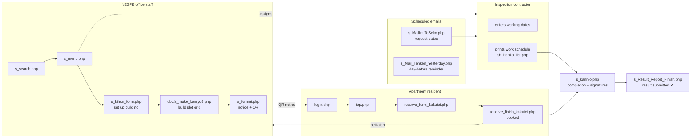
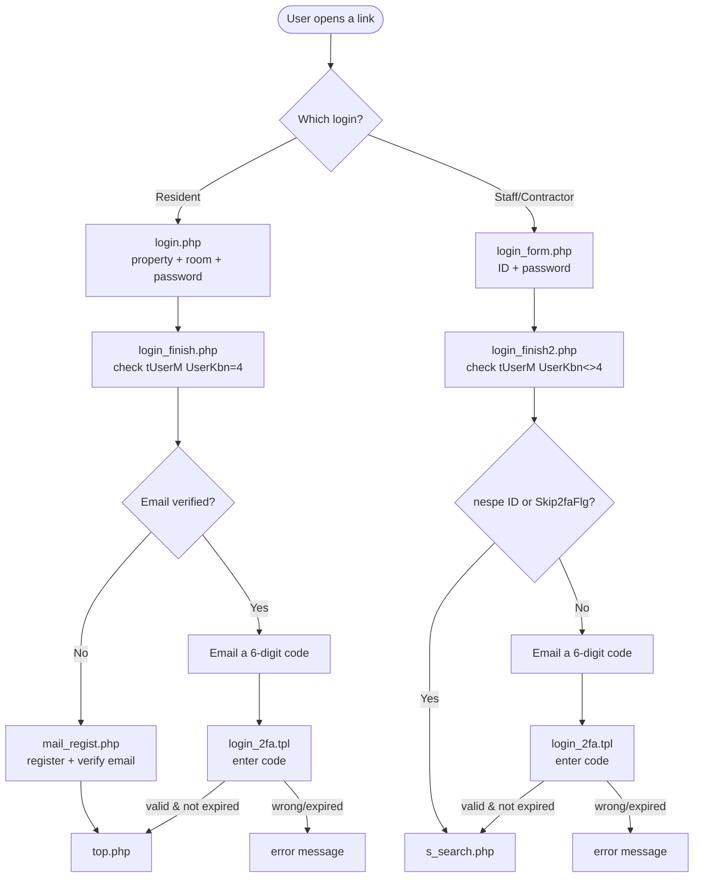

# 02. System Flow

> Step-by-step walk-through of how each type of user moves through the system, from login to the end of their task. Includes every major workflow with the actual file names involved.

---

## How to read this document

The system has **two front doors**:

- **Resident door** — `login.php` (template `login.tpl`). For apartment occupants.
- **Staff/contractor door** — `login_form.php` (template `login_form.tpl`). For NESPE staff and inspection contractors.

Each door has its own login-check script and its own home screen. After login, every page identifies the user by a session token called **`rKey`** that travels in the URL (e.g. `top.php?rKey=abc123...`). If the `rKey` is missing or expired, the page bounces the user back to the login screen.

---

## WORKFLOW A — Resident books an inspection slot

This is the most important end-user journey.

```
Resident scans QR code on a paper notice (or opens a link)
        │   URL carries editBukkenCD (property) + editBuildingCD (block)
        ▼
[login.php]  →  enter property number + room number + password
        │
        ▼
[login_finish.php]  checks the credentials in tUserM (UserKbn = 4)
        │
        ├─ email NOT registered/verified ─► [mail_regist.php] → enter email
        │                                        → 6-digit code emailed
        │                                        → [mail_confirm.tpl] enter code → [form.php]
        │
        └─ email already verified ─► a 6-digit code is emailed
                                       → [login_2fa.tpl] enter code
        ▼
[top.php]  (template top_kakutei.tpl) — the resident's property home screen
        │   Shows: building/room, current reservation (if any), the work period,
        │           and a single big action button.
        │
        ├─ first time? must complete customer info:
        │      [form.php] → [confirm.php] → [finish.php]
        │      (name, phone, email, choose a password, privacy consent)
        │
        ▼
[reserve_form_kakutei.php]  — pick ONE date on the calendar + ONE time slot
        │   Calendar marks: ○ available, △ few left, × full, 休 no-work day
        ▼
[reserve_confirm_kakutei.php]  — review the chosen date & time
        ▼
[reserve_finish_kakutei.php]  — save the reservation
        │   • writes tReservationF (Status = 1)
        │   • sets the resident's ReplyFlg / ConfirmFlg in tUserM
        │   • records "web activity" so a bell lights up for staff
        │   • sends a confirmation email
        ▼
   "予約完了" (booking complete) → back to top.php
```

### Changing or declining after booking

From `top.php`, a resident who already has a booking sees a **日程変更 (change)** button leading to:

```
[reserve_list.php] (reserve_list_kakutei.tpl)
   ├─ 確定する (Confirm)  → [kakutei.php] flag=1  → sets ConfirmFlg=1, emails confirmation
   ├─ 変更する (Change)   → [reserve_form_kakutei.php] (re-pick a slot)
   └─ 辞退する (Decline)  → [kakutei.php] flag=3  → sets ReplyFlg=3 (declined)
```

### Resident "absence / cannot be home" flag

`change_refuge_flg.php` is a small background call that sets `tUserM.RefugeFlg` so the crew knows a unit will be vacant/unavailable.

---

## WORKFLOW B — Staff set up a building and drive it to completion

```
[login_form.php]  →  staff ID + password
        ▼
[login_finish2.php]  checks tUserM (UserKbn ≠ 4)
        │   • IDs containing "nespe" or with Skip2faFlg skip the email code
        │   • everyone else gets a 6-digit email code → [login_2fa.tpl]
        ▼
[s_search.php]  — property search & list (scoped to the user's company/contractor)
        │   click a property
        ▼
[s_menu.php]  — the per-property hub. Live menu links:
        │
        ├─ 1. 作業準備 (Preparation)
        │      • 物件基本情報 → [s_kihon_form.php] → [s_kihon_finish.php]
        │            (units, floors, holidays, assigned contractor/staff)
        │      • 作業日程登録 → [doc/s_make_kanryo2.php]
        │            (configure teams/班, slot patterns, room matrix → build the grid)
        │
        ├─ 2. 入居者様対応 (Resident handling)
        │      • 案内資料生成 → [s_format.php] → [s_format_Excel.php]
        │            (preview the slot grid; download the resident notice Excel + QR)
        │      • 日程変更（TEL受付） → [sh_list.php]
        │            (staff book/confirm/change/decline a slot taken by phone)
        │
        └─ 3. 状況確認 (Status)
               • 作業工程表 → [sh_henko_list.php]   (list of all reservations & their status)
               • 完了報告  → [s_kanryo.php] → [s_sign.php] / [s_kanryo_download.php]
                            (signatures, completion report Excel)
        ▼
[s_Result_Report.php] → [s_Result_Report_Finish.php]
        (submit the inspection result checklist; sets tBukkenM.ReportSubmitted)
```

### The building's status progression

The building record (`tBukkenM`) carries a status that the workflow advances:

| `KikiStatus` value | Meaning | Set by |
|---|---|---|
| `0` | デフォルト (just created / reset) | new property, or the monthly reset batch |
| `1` | 日程登録依頼済 (date-registration requested) | the "request to contractor" email batch / button |
| `2` | 日程入力済 (dates entered) | the date-entry step |

(The fire-prevention track uses `BousaiStatus` with the same 0/1/2 meaning.)

---

## WORKFLOW C — Contractor (業者) view

```
[login_form.php] → [login_finish2.php]  (UserKbn = 3)
        ▼
[s_search.php]  — but the property list is filtered to
                  WHERE GyosyaCD = (this contractor)  OR  GyosyaBousaiCD = (this contractor)
        ▼
[s_menu.php] for one of their assigned properties
        ▼
   Enter the inspection working dates so the resident grid can be generated,
   then later view the work schedule and completion status.
```

Contractors only ever see their own assigned buildings; they cannot maintain master data unless they are a contractor-admin.

---

## WORKFLOW D — Automatic notifications (runs unattended on a schedule)

These scripts have no screen — they are designed to be triggered on a timer (cron / Windows Task Scheduler) and loop over all matching buildings.

```
~2 months before inspection month:
   [s_MailIraiToSeko.php]            → reset building to KikiStatus=1, email contractor:
                                        "please register inspection dates"
   [s_MailIraiToSeko_bouka.php]      → same, for the fire-prevention track

If dates still not registered after a while:
   [s_MailIraiToSeko_Saisoku.php]                 → reminder to the contractor
   [s_MailIraiToSeko_Saisoku_for_IraiMoto.php]    → escalation to internal staff (≈20 days)

The day before an inspection:
   [s_Mail_Tenken_Yesterday.php]            → "tomorrow's inspection" reminder to contractor
   [s_Mail_Tenken_Yesterday_for_Tanto.php]  → same reminder to internal staff
```

(Full details, recipients, and the live-vs-legacy list are in **08_notification_specification.md** and **10_batch_jobs.md**.)

---

## WORKFLOW E — The "bell" notification for staff

When a resident books or updates a reservation, the system writes a row to `tBukkenWebActivityF`. The staff console header shows a **bell icon with an unread badge** (driven by `js/bukken_alert.js`), which calls:

- `get_bukken_alerts.php` — returns the recent activity as JSON (count + list).
- `mark_bukken_alert_read.php` — marks alerts as read (single or all).

This lets office staff instantly see which buildings just had resident activity.

---

## End-to-end picture (all workflows combined)



---

## Login flow detail (both doors)



> **Code references:** resident login `httpdocs/login_finish.php`; staff login `httpdocs/login_finish2.php`; the email code is generated as `str_pad(random_int(0,999999),6,'0')` with a 30-minute expiry and sent by `sendTwoFactorAuthMail()` in `httpdocs/include/common_489.php`.
