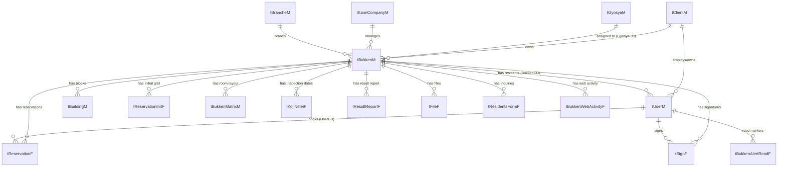

# 05. Database Specification

> Every table explained in understandable language: purpose, columns, relationships, where used, important flags, status values, soft-delete and created/updated columns.

---

## General conventions (read first)

- **Main database:** `kojihochiki` (MySQL). Connection settings in `httpdocs/setting.properties`. Two companion databases are configured: `skoji` (the "489" construction-unification platform) and `sms` (configured but unused).
- **Naming:** tables ending in **`M` = master** (reference data), ending in **`F` = fact/transaction** (operational data). Columns ending in **`CD` = a code/ID**.
- **No physical primary keys / AUTO_INCREMENT** in the dump (`kawamoto_dia.sql`). The `*CD` columns are *logical* keys; new IDs are generated in PHP by locking the table and doing `SELECT <CD> … ORDER BY <CD> DESC LIMIT 1` then `+1`. The only declared keys are in the newer migration `sql/tBukkenWebActivity.sql`.
- **Soft delete:** most tables carry **`MukouFlg`** (1 = invalid/deleted). Active rows are filtered with `MukouFlg = 0/FALSE`. Records are almost never physically deleted.
- **Audit columns:** most tables carry **`Created`, `Creator`, `Updated`, `Updater`** (Creator/Updater store a `UserCD`).
- **Pipe-encoded arrays:** several text columns store arrays as `|a|b|c|` (helpers `SPFWTools::encodePluralValue`/`decodePluralValue`). Examples: `Holiday1`, `ReserveDay`, `MaxWakuSu`, `MenuCD`, `tBukkenMatrixM.KaiRoom`.

### Japanese term key

| Term | Meaning |
|---|---|
| 物件 Bukken | property / apartment building (the central entity) |
| 棟 Tou / Building | a block within a multi-block property |
| 工事 Koji | construction / work | 
| 点検 Tenken | inspection |
| 機器 Kiki | equipment (inspection sub-type) |
| 総合 Sougou | general (inspection sub-type) |
| 防火/防災 Bouka/Bousai | fire-prevention / disaster-prevention (secondary inspection track) |
| 業者 Gyosya | (inspection) contractor / vendor |
| 担当 Tanto | person in charge (staff) |
| 日程 Nittei | schedule | 予約 Yoyaku | reservation |
| 枠 Waku | (time) slot | 班 Han | crew/team |
| 完了 Kanryo | completion | 配布 Haifu | distribution (of notices) |

---

## Core entity-relationship overview

---

## Master tables

### `tClientM` — Managing-company master (幹事企業)
- **Purpose:** the top-level tenant/organization (the company running inspections, e.g. NESPE). Everything else hangs off a `ClientCD`.
- **Columns:** `ClientCD` (logical PK), `ID`, `Passwd`, `ClientName`, `Yomikata` (reading), `Notes`, `TEL`, `FAX`, `BusinessHours`, `BusinessHoursNote`, `MukouFlg`, audit columns.
- **Where used:** scoping nearly every list (staff only see their own client); contact info on resident emails.

### `tUserM` — User master (residents, staff, contractors)
- **Purpose:** every human (and effectively every apartment *room*) in the system. The single most reused table.
- **Key columns:**
  - `UserCD` (logical PK), `ID` (login id / room number), `Passwd`, `Passwd2` (changed password), `ClientCD`, `BukkenCD` (which property), `BuildingCD` (which block), `Address3` (棟 symbol).
  - **`UserKbn`** — user type: **1**=幹事企業一般 (staff general), **2**=管理者 (staff admin), **3**=協力業者 (contractor), **4**=入居者 (resident).
  - `GyosyaCD` (contractor company), `BrancheCD` (branch), `EigyosyoCD` (office), `UserRole` (1=営業/2=施工), `UserType` (1=admin within role).
  - `LastName`(+Kana) = name; `Address1` = **email address** (note: not the obvious `EMail` column, which is unused); `TEL` = phone.
  - **`RegistKey`** = the session token; `IdentifyKey`; `LastLogin`, `LastLoginIP`.
  - Two-factor: `EmailVerificationCode`, `EmailVerificationExpiry`, `EmailVerified`, `Skip2faFlg`.
  - Reservation state on the resident: **`ReplyFlg`** (0/none, 1=WEB受付, 2=TEL受付, 3=辞退/declined), **`ConfirmFlg`** (1=confirmed), **`RefugeFlg`** (1=absent/cannot be home), `Completed`.
  - `LineID` (LINE id, mostly unused), `Extra1..Extra10` (reused for org data in legacy code: Extra1=支店CD, Extra3=role, Extra4=営業所CD, Extra5=業者CD, Extra6=支店営業所名, Extra7=旧UserType).
  - `MukouFlg`, audit columns.
- **Note:** many columns are explicitly commented `未使用` (unused) — relics of the generic CMS/membership framework SPFW was forked from (Points, MailMagaFlg, Birthday, FacePhoto, etc.).
- **Maps to model:** `SPFW/class/SPUSUser.cls` (class `User`).

### `tBukkenM` — Property master (物件) — the hub
- **Purpose:** one row per building project; the center of the whole system. Very wide (~95 columns).
- **Identity & org:** `BukkenCD` (logical PK), `ClientCD`, `BukkenName`(+Kana), `SagyoName` (work name), `Address`, `KenmeiNo` (work/project number), `BrancheCD`, `KanriCompanyCD`, `GyosyaCD` (equipment contractor), `GyosyaBousaiCD` (fire-prevention contractor), `TantoCD1..5` (assigned staff).
- **Sizing:** `Kosu` (unit count), `Kaidaka` (floor count), `Hansu` (number of crews), `TatoFlg` (multi-block flag), `BuildingName`.
- **Scheduling config:** `WakuPattern` (slot pattern), `MaxWakuSu` (max slots, e.g. `10-10`), `FirstDateFeature` (first-day rule), `FrameOverflow` (overflow), `ArrangeType` (1=inspection/0=construction), `MinuteTime` (minutes per unit), `Holiday1` (no-work days), `ReserveDay` (reserve days), `FloorReserveInfo` (per-floor JSON config), `CloseTime`.
- **Dates:** `SenyuStartDate`/`SenyuEndDate` (in-unit work period), `SenyuStartDate1`/`EndDate1` (block 1), `KyoyobuStartDate`/`EndDate` (common-area period), `SenyubuStartDate`/`EndDate`, `YoyakuEndDate` (reception deadline), `UketsukeShimekiriDate`, `Date1..Date6` (the actual inspection days), `FirstKojiDate`/`LastKojiDate`, `ReceptionDate`, `HaifuDownloadDate`.
- **Inspection (equipment/shobou):** `KikiTenkenMonth`, `KikiTenkenKikan` (days needed), `KikiAMKojiTime`/`KikiPMKojiTime`, `SougouTenkenMonth`, `SougouTenkenKikan`, `SougouAMKojiTime`/`SougouPMKojiTime`, `ExistTenkenKikan`/`_Sougou` (entry mode), `FormatType`/`FormatType2`, `Same_kiki_sougou_flg`, `LatestIraiKojiKind` (1=機器/2=総合).
- **Fire-prevention (bouka):** `BousaiFlg` (on/off), `BousaiStartDate`/`BousaiEndDate`, `BousaiKojiTime`, `BousaiTenkenMonth`, `GyosyaBousaiCD`, `KanriCompanyBousaiCD`, `BousaiLastUpdater`/`Updated`, `BoukaBikou`.
- **Status flags:**
  - **`KikiStatus`** (0=default, 1=date-registration requested, 2=dates entered) — equipment workflow.
  - **`SougouStatus`** (same scale) — general inspection.
  - **`BousaiStatus`** (same scale) — fire-prevention.
  - `ReportSubmitted` (1 = inspection report submitted).
- **Memos:** `Memo`, `BukkenMemo`, `Biko`, `Biko_forReport`.
- **Soft delete / audit:** `MukouFlg`, `Created`, `Creator`, `Updated`, `Updater`, plus `SagyoLastUpdater`/`SagyoLastUpdated`.
- **Maps to model:** `SPUSBukken.cls` (class `Bukken`).

### `tBuildingM` — Block master (棟)
- **Purpose:** for multi-block properties (`TatoFlg=1`), one row per block; overrides property-level dates/sizes when a `editBuildingCD` is in play.
- **Keyed by:** `BuildingCD`, with `BukkenCD`. Maps to `SPUSBuilding.cls`.

### `tBukkenMatrixM` — Room layout matrix (部屋構成)
- **Purpose:** stores the floor × room grid for a property/block in `KaiRoom` (pipe-encoded). Used to build the booking grid. Maps to `SPUSBukkenMatrix.cls`.

### `tGyosyaM` — Contractor master (業者)
- **Purpose:** inspection vendor companies. Columns: `GyosyaCD`, `ClientCD`, `GyosyaName`(+Kana), `GyosyaTEL`, `GyosyaPasswd`, `GyosyaMail`/`GyosyaMail2`, `GyosyaNotes`, `IsSyoubou` (does fire-equipment), `IsBouka` (does fire-prevention), `MukouFlg`, audit. Many legacy unused columns. Maps to `SPUSGyosya.cls`.

### `tKanriCompanyM` — Building-management-company master (管理会社)
- **Purpose:** the firm that manages each building. Columns: `KanriCompanyCD`, `ClientCD`, `KanriCompanyName`(+Kana), `CompanyTEL`, `Notes`, `MukouFlg`, audit. Maps to `SPUSKanriCompany.cls`.

### `tBrancheM` — Branch-office master (支店・支社)
- **Purpose:** NESPE branch offices. Columns: `BrancheCD`, `ClientCD`, `BrancheName`(+Kana), `BrancheTEL`, `MukouFlg`, audit. Maps to `SPUSBranche.cls`.

### `tEigyoshoM` — Sales-office master (営業所)
- **Purpose:** sub-office under a branch; contact details used on notices. Maps to `SPUSEigyosho.cls`.

### `tMenuM` — Menu/service master
- **Purpose:** the inspection "menu" item(s) booked against a slot (`MenuCD` on reservations). Legacy from the salon-booking origin of SPFW. Maps to `SPUSMenu.cls`.

### `tStylistM` — Crew/lane master (班)
- **Purpose:** the inspection crew/lane a reservation is assigned to (`StylistCD`). "Stylist" is a legacy name from SPFW's salon origins; here it means an inspection team/lane. Maps to `SPUSStylist.cls`.

### `tSettingM` / `tSettingDatesM` — Settings & available-dates masters
- **Purpose:** per-property reservation settings, and the set of selectable inspection dates (the older availability mechanism, edited via `s_Set_Dates.php`). Map to `SPUSSetting.cls` / `SPUSSettingDates.cls`.

### `tAdministratorM` — Legacy framework-admin master
- **Purpose:** logins for the old SPFW back-office tooling (not the Hochiki workflow). Driven by `SPFW/inc/authorize.inc`. `latin1` charset (legacy). Maps to `SPUSAdministrator.cls`.

---

## Transaction / fact tables

### `tReservationF` — Reservations (the live work-schedule grid)
- **Purpose:** one row per **room-slot** — i.e. a unit's booked (or template) inspection slot. This is both the booking record and the work-schedule grid cell.
- **Columns:** `ReservationCD` (logical PK), `ClientCD`, `BukkenCD`, `BuildingCD`, `ID` (room number), `UserCD` (the resident/room), `StylistCD` (crew/班), `TimeFrom`/`TimeTo` (slot datetime), `MenuCD` (pipe-encoded), **`Status`** (1=active), `FreeFlg`, `Memo`, `Notes`, **`KanryoFlg`** (1=completed/signed), `TimeExact`/`TimeMeaning` (exact-time spec), **`HanNo`** (crew/team number), **`ViewOrderNo`** (display order), `R003`/`R004`/`R005` (slot-type markers like `aki`/`wakuover`), `MukouFlg`, audit columns.
- **Where used:** booking flow, `sh_list.php`, `sh_henko_list.php`, completion, grid preview.
- **Status semantics:** `Status=1` active. Completion is `KanryoFlg=1`. The resident's confirm/decline state lives on `tUserM` (`ReplyFlg`/`ConfirmFlg`), not here.
- **Maps to model:** `SPUSReservation.cls`.

### `tReservationInitF` — Initial/template grid
- **Purpose:** the generated empty baseline grid (same structure as `tReservationF`) used as the template/source for the notice grid. Maps to `SPUSReservationInit.cls`.

### `tReservationTempF` — Per-user auto-save
- **Purpose:** a working/temporary copy of a reservation edit (no `MukouFlg`). Maps to `SPUSReservationTemp.cls`.

### `tKojiNitteiF` — Inspection-date rows (工事日程)
- **Purpose:** the inspection day/time rows for a property (for both 機器 and 総合), used to fill notices. `latin1` charset. Maps to `SPUSKojiNittei.cls`.

### `tKojiDateF` — Construction date records
- **Purpose:** construction/work date records keyed by `BukkenCD`. Maps to `SPUSKojiDate.cls`.

### `tSignF` — Signatures (完了サイン)
- **Purpose:** one row per captured resident signature; stores the saved image path (`FilePath`) and links `BukkenCD`/`BuildingCD`/`ID`/`UserCD`. Setting a sign marks the matching reservation complete. Maps to `SPUSSign.cls`.

### `tResultReportF` — Inspection result reports
- **Purpose:** the inspection checklist result per property (one current row; old ones invalidated by `MukouFlg`). Stores each equipment item's confirmation flag + memo. Maps to `SPUSResultReport.cls`.

### `tResidentsFormF` — Resident inquiries / date requests (legacy "Taio")
- **Purpose:** resident-submitted inquiries/date requests; columns include `FormCD`, `BukkenCD`, `RoomNo`, `Name`, `TEL`, `Contents`, `IsInRoom`, `DemandDate`, `AMPM`, `Dates`, `MailAddress`, `TaioLog` (staff handling notes), `Moved_at` (archive month), `MukouFlg`, audit. Maps to `SPUSResidentsForm.cls`.

### `tFileF` — Property files
- **Purpose:** uploaded files per property: `FileKind` 1=図面 (drawings), 2=点検報告書 (reports), 3=お知らせ (notices). `latin1` charset. Maps to `SPUSFile.cls`.

### `tUploadFileF` — Upload records
- **Purpose:** generic uploaded-file records (no `MukouFlg`). Maps to `SPUSUploadFile.cls`.

### `tNoticeF` — Notices/announcements
- **Purpose:** お知らせ shown in the staff console (uses `MMemoUpdated`). Maps to `SPUSNotice.cls`.

### `tCalendarF` — Calendar / holidays
- **Purpose:** per-client calendar data (holidays, capacity) consulted by the slot engine. Maps to `SPUSCalendar.cls`.

### `tIraiRenkeiF` — Construction-request linkage
- **Purpose:** the handoff sheet between sales (`TantoCD*`) and contractor (`GyosyaTantoCD*`) for the 489 construction linkage. `MyISAM` (others are InnoDB). Maps to `SPUSIraiRenkei.cls`.

---

## Migration tables (`sql/tBukkenWebActivity.sql`)

### `tBukkenWebActivityF` — Per-property web activity (for the staff bell)
- **Declared PK = `BukkenCD`.** Columns: `BukkenCD`, `LastWebActivityAt` (datetime), `LastActivityType` (1=予約/reservation, 2=更新/update). No soft-delete.

### `tBukkenAlertReadF` — Alert read-state
- **Declared composite PK = (`UserCD`, `BukkenCD`).** Columns: `UserCD`, `BukkenCD`, `LastReadAt`. Records when each staff user last read a property's alert.

---

## Tables referenced by code but NOT in `kawamoto_dia.sql`

The application also references these (they exist in some environments / the `skoji` DB but are not in this dump). Flag for a follow-up schema export:

`tKojiF`, `tTaioF` (response handling), `tRingiM` (approval), `tKeibiM` (security), `tGyosyaTantoM`, `tScheduleM`, `tDeviceM`, `tSagyoinM`, `tSitenM`, `tShozokuM`, `tTatoM`, `tWordM` (multilingual labels), `tOKIPM` (IP access log), `tPictureF`, plus the Aiphone Oracle tables (`T_BKNKHN`, `T_BSYMST`, `T_BMNMST`, `T_SHNMST`, `T_JUTYUH/M`) used by `kenmei_connect.php`.

> See **14_unknown_logic.md** for the open question about the database name mismatch (`kojihochiki` vs `kojikotei` hardcoded in some batch scripts) and the missing tables.

---

## Class → table mapping (quick reference)

| Model class (`SPFW/class/`) | Table |
|---|---|
| `SPUSUser` (`User`) | `tUserM` |
| `SPUSBukken` (`Bukken`) | `tBukkenM` |
| `SPUSBuilding` (`Building`) | `tBuildingM` |
| `SPUSBukkenMatrix` | `tBukkenMatrixM` |
| `SPUSReservation` | `tReservationF` |
| `SPUSReservationInit` | `tReservationInitF` |
| `SPUSReservationTemp` | `tReservationTempF` |
| `SPUSGyosya` | `tGyosyaM` |
| `SPUSKanriCompany` | `tKanriCompanyM` |
| `SPUSBranche` | `tBrancheM` |
| `SPUSEigyosho` | `tEigyoshoM` |
| `SPUSKojiNittei` | `tKojiNitteiF` |
| `SPUSKojiDate` | `tKojiDateF` |
| `SPUSSign` | `tSignF` |
| `SPUSResultReport` | `tResultReportF` |
| `SPUSResidentsForm` | `tResidentsFormF` |
| `SPUSFile` | `tFileF` |
| `SPUSUploadFile` | `tUploadFileF` |
| `SPUSNotice` | `tNoticeF` |
| `SPUSCalendar` | `tCalendarF` |
| `SPUSMenu` | `tMenuM` |
| `SPUSStylist` | `tStylistM` |
| `SPUSSetting` / `SPUSSettingDates` | `tSettingM` / `tSettingDatesM` |
| `SPUSClient` | `tClientM` |
| `SPUSAdministrator` | `tAdministratorM` |
| `SPUSIraiRenkei` | `tIraiRenkeiF` |
