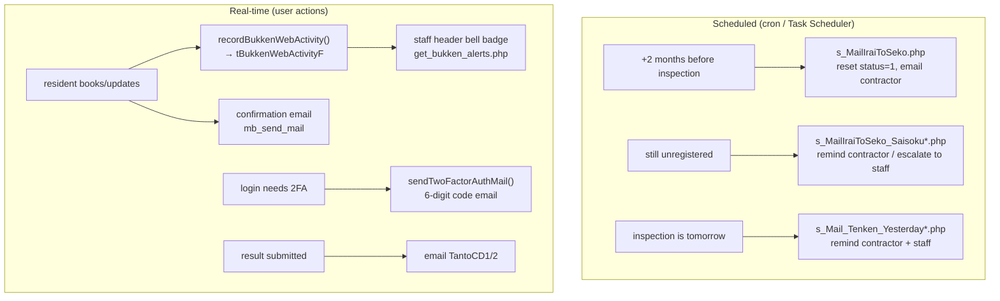

# 08. Notification Specification

> Every notification the system produces: bell notifications, emails, the jobs/queues/triggers behind them, and what is (and isn't) implemented.

---

## Channels at a glance

| Channel | Status | Mechanism |
|---|---|---|
| In-app "bell" (staff header) | ✅ Live | `js/bukken_alert.js` + `get_bukken_alerts.php` polling, backed by `tBukkenWebActivityF` |
| Email (resident confirmations) | ✅ Live | `mb_send_mail()` from the reservation finish scripts |
| Email (contractor/staff batch) | ✅ Live | `mb_send_mail()` from scheduled `s_Mail*` scripts |
| Email (2-factor codes) | ✅ Live (inline) | `sendTwoFactorAuthMail()` called from login scripts |
| SMS / Twilio | ❌ Not implemented | `sms` DB configured but unused; `s_Taio_List_twilio.php` is a mislabeled copy, sends no SMS |
| LINE notify | ❌ Not implemented | `LineID` column exists; no integration code |
| Webhook / Slack / Push | ❌ Not present | none |

---

## 1. Bell notification (staff console)

- **What:** a bell icon with an unread badge in the staff header (injected via `$SHeaderKanri2` in `SPFW/inc/system.properties`, script `js/bukken_alert.js?v=6`).
- **Trigger:** a resident books or updates a reservation → `recordBukkenWebActivity($myDB, $BukkenCD, $type)` upserts `tBukkenWebActivityF` (`type 1`=予約, `2`=更新). Called from `reserve_finish*.php` / `kakutei.php`.
- **Display:** `get_bukken_alerts.php` returns the latest 8 activities (count + items) as JSON; the badge shows the unread count.
- **Scope:** by role via `getBukkenAlertScopeSql()` — staff `UserKbn 1/2` by `ClientCD` (+`BrancheCD` for general staff), contractors `UserKbn 3` by `GyosyaCD`/`GyosyaBousaiCD`; residents excluded.
- **Read-state:** `mark_bukken_alert_read.php` upserts `tBukkenAlertReadF` (single property via `editBukkenCD`, or `markAll`).
- **Code:** `httpdocs/include/bukken_alert.php`, `httpdocs/get_bukken_alerts.php`, `httpdocs/mark_bukken_alert_read.php`.

---

## 2. Email — 2-factor authentication code

- **Function:** `sendTwoFactorAuthMail($toMail, $code, $Expiry, $url)` in `httpdocs/include/common_489.php`.
- **Content:** Japanese plain-text body with the 6-digit code, its expiry time, and a login link.
- **Trigger:** during login when 2FA is required (`login_finish.php`, `login_finish2.php`) and during email registration (`mail_regist.php`).
- **Note:** the `mb_send_mail` call inside the helper function is commented out, but the login scripts also send inline — confirm which path is active per environment.

---

## 3. Email — resident reservation confirmations

- **Trigger:** the resident confirms/changes/declines (`reserve_finish_kakutei.php`, `kakutei.php`).
- **Recipient:** the resident (and contact info pulled from `tClientM`/`tBrancheM`).
- **Content:** confirm / change / decline wording with the date & time.
- **Mechanism:** `mb_send_mail()` (UTF-8, `From: info@nespe.jp`/`.com`).
- **Note:** LINE-notify branches exist in the code but are commented out.

---

## 4. Email — scheduled batch notifications

All of these are screen-less scripts designed to run on a timer (see **10_batch_jobs.md**). They loop over all matching properties and send `mb_send_mail()`.

### Group A — "IraiToSeko" = request the contractor to register dates

| Script | Track | Target | Recipient | Subject |
|---|---|---|---|---|
| `s_MailIraiToSeko.php` ✅ live | equipment | inspection month = +2 months; **resets** `KikiStatus=1`, clears report | contractor `IsSyoubou=1` (`GyosyaMail`/`Mail2`) | `【点検システム】<月>月点検分　実施日登録依頼` |
| `s_MailIraiToSeko_bouka.php` ✅ live | fire-prevention | +2 months; resets `BousaiStatus=1` | contractor `IsBouka=1` | `【点検システム】<月>月点検分　防火実施日登録依頼` |
| `s_MailIraiToSeko_ueda.php` | equipment | variant (sets `Moved_at` differently) | contractor | same as live |
| `s_MailIraiToSeko_backup.php` | equipment | backup (no `Moved_at` update) | contractor | — |
| `s_MaiIraiToSeko.php` (legacy) | equipment | old version, no `IsSyoubou` filter | contractor | `点検日程登録依頼` |
| `IraiToSekoCompany.php` ✅ web button | equipment | on click, one property | contractor | `<BukkenName>の点検日程登録依頼` |

### Group B — "Saisoku" = reminders / escalations

| Script | Target | Recipient | Subject |
|---|---|---|---|
| `s_MailIraiToSeko_Saisoku.php` ✅ | +2 months, still status 0/1 | contractor (equipment) | `再通知【点検システム】…実施日登録依頼` |
| `s_MailIraiToSeko_Saisoku_bouka.php` ✅ | +2 months, `BousaiStatus=1` | contractor (fire-prevention) | `再通知…` |
| `s_MailIraiToSeko_Saisoku_for_IraiMoto.php` ✅ | ~20 days, no registration | internal staff `TantoCD1..5` (+CC for ClientCD 131) | `【点検進捗管理】<BukkenName>実施日未登録のお知らせ` |
| `s_MailIraiToSeko_Saisoku_for_IraiMoto_2.php` | ~16 days, `ClientCD≠131` | hardcoded overseer (`t.kaneko@rki.co.jp`) | same family |
| `s_MailIraiToSeko_Saisoku_for_IraiMoto_bouka.php` ✅ | ~20 days (fire-prevention) | `TantoCD1/2` | `【防火点検進捗管理】…実施日未登録のお知らせ` |
| `s_MaiIraiToSeko_Saisoku.php` (legacy) | old reminder | contractor | `点検日程登録依頼` |

### Group C — "Tenken Yesterday" = day-before inspection reminder

> Filenames say "Yesterday" but the logic targets **tomorrow** (`strtotime('+1 day')`). Daily jobs.

| Script | Target | Recipient | Subject |
|---|---|---|---|
| `s_Mail_Tenken_Yesterday.php` ✅ | `Date1` = tomorrow | contractor (`IsSyoubou=1`) | `【点検進捗管理】明日の点検物件のお知らせ` |
| `s_Mail_Tenken_Yesterday_bouka.php` ✅ | `BousaiStartDate` = tomorrow | contractor (`IsBouka=1`) | `【防火点検進捗管理】明日の点検物件のお知らせ` |
| `s_Mail_Tenken_Yesterday_for_Tanto.php` ✅ | `Date1` = tomorrow | internal staff `TantoCD1..5` | `【点検進捗管理】<BukkenName>点検前日のお知らせ` |
| `s_Mail_Tenken_Yesterday_for_Tanto_bouka.php` ✅ | `BousaiStartDate` = tomorrow | internal staff | `【防火点検進捗管理】<BukkenName>防火点検前日のお知らせ` |

### Email — inspection result submitted

- **Trigger:** `s_Result_Report_Finish.php` after a result is saved.
- **Recipient:** the property's `TantoCD1`/`TantoCD2` (via their `Address1` email).
- **Content:** "the report for `<BukkenName>` is complete".

---

## Notification flow diagram

---

## Mail-sending mechanisms (two pipelines)

1. **Direct `mb_send_mail()`** — used by all batch/AJAX/login scripts. UTF-8 body, `From: info@nespe.jp`/`.com`, no attachments. Simple and what most notifications use.
2. **SPFW framework mailer** (`SPFW/class/SPFWMail.cls` + `SPFWMailSend.cls`, a bundled classic PHPMailer) — supports HTML, attachments, ISO-2022-JP encoding, and SMTP/sendmail. Used by the broader/legacy app paths. Note it assumes EUC-JP source → converts to JIS, whereas the batch scripts assume UTF-8 — two independent encodings.

---

## Queues

There is **no message queue**. "Batch" = scripts run directly on a schedule; "real-time" = synchronous `mb_send_mail()` during the request. Email delivery depends on the server's local MTA.
