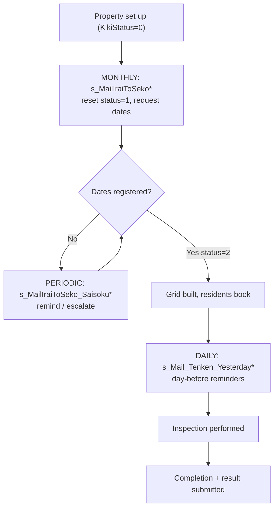

# 10. Batch Jobs / Scheduled Tasks

> Documentation of cron / queue / scheduled / background jobs.

---

## How scheduling works here

- **There is no committed cron table or Task Scheduler config in the repo.** Scheduling is configured **outside** the codebase (on the server, via cron or Windows Task Scheduler, likely invoking the scripts over HTTP with `wget`/`curl` or via PHP CLI).
- The batch scripts are written to run **unattended**: no login, no UI, no template output. Each opens its own DB connection, loops over all matching properties using date math (`today`, `+1 day`, `+2 month`), sends emails, and exits.
- **There is no message queue.** Everything is synchronous within each script run.

---

## Job catalogue

### A. Monthly "request contractor to register dates" (runs monthly)

| Script | Track | What it does |
|---|---|---|
| `httpdocs/s_MailIraiToSeko.php` ✅ | equipment (消防) | Target = inspection month is +2 months. **Bulk-resets** matching properties: `KikiStatus=1`, `ReportSubmitted=0`; invalidates old `tResultReportF`; archives inquiries (`tResidentsFormF.Moved_at`). Emails each contractor (`IsSyoubou=1`). |
| `httpdocs/s_MailIraiToSeko_bouka.php` ✅ | fire-prevention (防火) | Same idea: resets `BousaiStatus=1` for `BousaiTenkenMonth=+2mo`; emails `IsBouka=1` contractors. |

### B. Reminders & escalations (runs periodically — e.g. daily/weekly)

| Script | What it does |
|---|---|
| `httpdocs/s_MailIraiToSeko_Saisoku.php` ✅ | Reminds equipment contractors with still-unregistered properties (`KikiStatus IN (0,1)`), subject `再通知…`. |
| `httpdocs/s_MailIraiToSeko_Saisoku_bouka.php` ✅ | Same for fire-prevention. |
| `httpdocs/s_MailIraiToSeko_Saisoku_for_IraiMoto.php` ✅ | ~20-day escalation to internal staff (`TantoCD1..5`); special CC for `ClientCD=131`. |
| `httpdocs/s_MailIraiToSeko_Saisoku_for_IraiMoto_2.php` | ~16-day variant to a hardcoded overseer (`ClientCD≠131`). |
| `httpdocs/s_MailIraiToSeko_Saisoku_for_IraiMoto_bouka.php` ✅ | ~20-day fire-prevention escalation to `TantoCD1/2`. |

### C. Day-before inspection reminders (runs daily)

| Script | What it does |
|---|---|
| `httpdocs/s_Mail_Tenken_Yesterday.php` ✅ | Emails contractors whose property `Date1` = tomorrow. |
| `httpdocs/s_Mail_Tenken_Yesterday_bouka.php` ✅ | Same where `BousaiStartDate` = tomorrow. |
| `httpdocs/s_Mail_Tenken_Yesterday_for_Tanto.php` ✅ | Emails internal staff `TantoCD1..5` for tomorrow's inspections. |
| `httpdocs/s_Mail_Tenken_Yesterday_for_Tanto_bouka.php` ✅ | Same, fire-prevention. |

### D. Maintenance scripts (shell, Linux-oriented)

| Script | What it does | Notes |
|---|---|---|
| `SPFW/logmaintenance.sh` | Rotates `log/db.log`, `debug.log`, `error.log`, `sql.log` (keeps 3 generations). | `ROOTPATH` points to `C:/xampp/htdocs/kotei/` (stale path). DB-dump lines commented out. Cron-style. |
| `SPFW/setup.sh` | One-time deployment: chmod log/obj/text dirs, create `upfile`, snapshot original config. | Not recurring. |

### E. Data files used by scheduling

- `httpdocs/holiday.log` — CSV of Japanese public holidays (2014–2022) used to skip holidays. **Stale (ends 2022)** — see improvements.
- `$SHUKUJITULIST` in `SPFW/inc/489.properties` — hard-coded holiday list (2020–2023). Also stale.

---

## Duplicate / legacy / test variants (NOT scheduled)

To avoid confusion, these exist but should not be put on a schedule:

- **Backup/legacy mailers:** `s_MailIraiToSeko_backup.php`, `s_MaiIraiToSeko.php`, `s_MaiIraiToSeko_Saisoku.php` (note the misspelling "Mai").
- **Variant:** `s_MailIraiToSeko_ueda.php` (developer variant).
- **Web-page test copies (not batch):** `s_date2_test.php`, `s_date_bousai_test.php`, `s_date_bousai_finish2_test.php`, `s_date_finish2_test.php`, `s_haihu_list_test.php`, `s_upload_file_for_report_test.php`, `s_menu_test.php`, `ns_monthly_test.php`, `mecab_test.php`.

---

## Recommended schedule (inferred — confirm with operations)

| When | Job(s) |
|---|---|
| Monthly (early in month) | `s_MailIraiToSeko.php`, `s_MailIraiToSeko_bouka.php` |
| Weekly / few-days cadence | the `_Saisoku_*` reminders & escalations |
| Daily | `s_Mail_Tenken_Yesterday*.php` (all four) |
| Daily/weekly | `SPFW/logmaintenance.sh` |

> The exact cadence is **not in the repo** — recorded as an open item in **14_unknown_logic.md**. Confirm the actual crontab / Task Scheduler entries on the production server.

---

## Job dependency diagram

